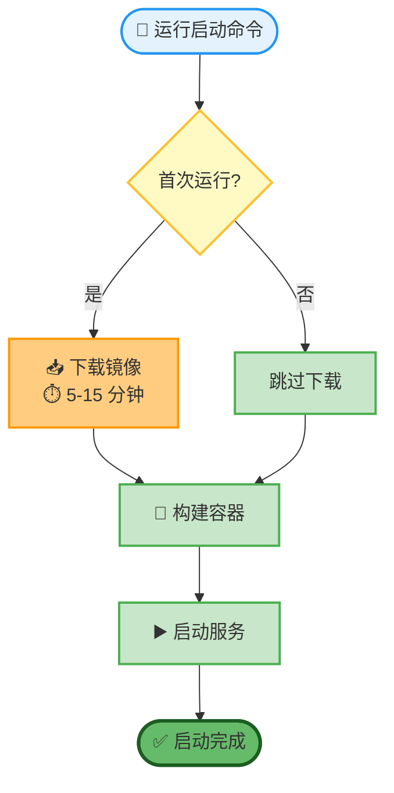
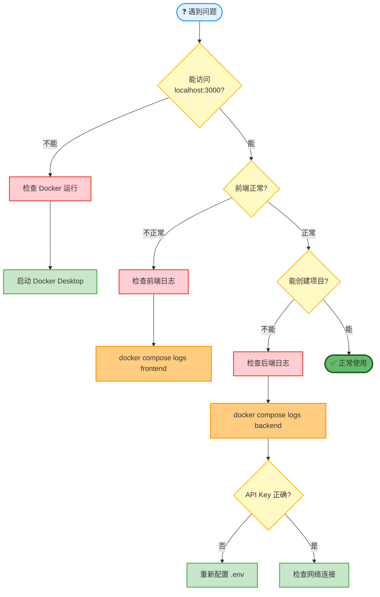
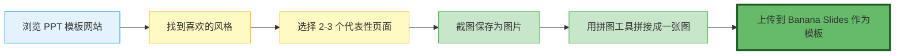

# Banana Slides 新人部署教程

> 🎯 本教程专为**没有任何服务器部署经验的新手**设计，手把手教你从零开始部署 Banana Slides 项目。
>
> 📖 预计耗时：30-60 分钟（取决于网络速度和系统配置）

> 📸 **图文演示**：想快速了解本教程的内容？[点击查看完整的教程 PPT 演示](./TUTORIAL_SLIDES.md) 🎬

---

## 🍌 Banana Slides 是什么？

想象一下：你只需要告诉 AI "我要做一个关于人工智能的 PPT，10 页，现代科技风格"，然后：

📋 **第 1 步**：AI 自动帮你生成大纲和每一页的内容描述

🎨 **第 2 步**：你选择一个喜欢的风格模板（就像选手机壁纸一样简单）

✨ **第 3 步**：AI 自动生成每一页的图片，文字、排版、配色全都有了

📥 **第 4 步**：直接导出 PPT 文件，可以编辑和展示

**就这么简单！** 不需要你会设计，不需要你会排版，甚至不需要你完全理解要讲的内容——AI 会帮你完成所有脏活累活。

<details>
<summary><b>📖 想了解更多？点击展开查看详细介绍</b></summary>

### 🤔 它和传统 PPT 制作有什么不同？

| 传统方式 | Banana Slides |
|---------|----------------|
| 😰 打开 PPT，对着空白页面发呆 | 💬 告诉 AI 你的想法 |
| 😵 从头开始设计每一页的排版 | 🎨 选择一个喜欢的模板风格 |
| 🤔 到处找合适的图片和图标 | 🤖 AI 自动生成配图 |
| 😫 调整字体、颜色、对齐... | ✨ 一键生成，已经帮你排好了 |
| ⏰ 花费几小时甚至几天 | ⚡ 几十分钟搞定 |

### 🛠️ 它是怎么工作的？

其实它的原理特别简单，就三件事：

1. **懂你**：你用中文告诉它你要做什么（比如"做一个季度销售报告"）
2. **懂设计**：它有一个很厉害的 AI 模型（叫 nano banana），擅长做 PPT 风格的图片
3. **会生成**：它把你的文字和风格要求结合起来，生成每一页的图片

**举个例子**：

> **你输入**："做一个 5 页的产品介绍 PPT，简约商务风格，蓝色主题"
>
> **它的工作**：
> - 第 1 页：生成封面，有产品名、标语、蓝色渐变背景
> - 第 2 页：生成产品特点页面，3 个要点，配图标
> - 第 3 页：生成应用场景页面，配产品使用图
> - 第 4 页：生成竞争优势页面，用对比图表
> - 第 5 页：生成联系方式页面，简洁清晰
>
> **你得到**：5 张精美的图片，可以直接导出成 PPT 文件

### 💡 为什么需要"部署"？

你可能在想："为什么不直接给我一个网址，让我上去用就好了？"

好问题！Banana Slides 是一个**开源项目**，意味着：
- ✅ **数据安全**：所有生成的 PPT 都在你自己的电脑上，不会上传到别人的服务器
- ✅ **没有限制**：不用担心某天服务停止了，或者开始收费了
- ✅ **完全免费**：只需要付 AI 的费用（几块钱就能生成几十页），没有其他费用
- ✅ **随时可用**：部署在自己电脑上，想用就用

### 🎯 适合谁使用？

| 你是 | Banana Slides 能帮你 |
|------|---------------------|
| 👨‍💻 **程序员** | 快速做技术分享、项目汇报 |
| 👨‍🏫 **老师** | 把课程内容快速变成课件 |
| 👩‍💼 **销售** | 给客户展示产品方案 |
| 🎓 **学生** | 作业汇报、答辩 PPT |
| 👔 **职场人** | 工作汇报、总结计划 |
| 🎨 **设计师**：虽然你会设计，但用它快速出方案也很爽 |

### 🚀 接下来做什么？

如果你已经跃跃欲试，让我们开始部署吧！整个过程就像安装一个软件一样简单，跟着教程一步步来就行。

别担心"部署"这个词听起来很专业——其实就是"在你的电脑上运行这个工具"的意思。我们会用 Docker 来帮你完成，Docker 就像一个"软件运行器"，可以让安装过程变得超级简单。

### 📄 想先看看效果？

在开始部署之前，你可以先看看 Banana Slides 生成的示例 PDF，了解一下它能做到什么效果：

- 📱 [手机摄影入门：每个人都是摄影师](../assets/手机摄影入门：每个人都是摄影师.pdf)（34 MB）- 10 页，现代简约风格
- 🏞️ [遇见凉都•金红盘州](../assets/遇见凉都•金红盘州.pdf)（42 MB）- 12 页，旅游主题风格

> 💡 **提示**：这些示例都是用 Banana Slides 自动生成的，展示了它在不同主题和风格下的效果。下载后可以查看图片质量、文字清晰度和整体设计感。

准备好了吗？让我们开始吧！ 🎉

</details>

---

## 📋 目录

**快速导航**：
- [你的系统？](#7-附录docker-安装教程) - 快速跳转到对应系统的 Docker 安装教程

**主要章节**：
0. [部署说明](#0-部署说明)
1. [部署前准备](#1-部署前准备)
2. [系统要求](#2-系统要求)
3. [一键部署步骤](#3-一键部署步骤)
4. [常见问题排查](#4-常见问题排查)
5. [更新与维护](#5-更新与维护)
6. [📝 使用技巧与最佳实践](#6--使用技巧与最佳实践) ← 推荐阅读！
   - 6.0 [效果示例展示](#60-效果示例展示)
   - 6.1 [从想法到完整 PPT 的推荐工作流](#61-从想法到完整-ppt-的推荐工作流)
   - 6.2 [巧用页面数量控制](#62-巧用页面数量控制)
   - 6.3 [选择合适的参考图/模板](#63-选择合适的参考图模板)
   - 6.4 [参考图质量要求](#64-参考图质量要求)
   - 6.5 [模板管理技巧](#65-模板管理技巧)
   - 6.6 [充分利用参考文档](#66-充分利用参考文档)
   - 6.7 [在描述顶部添加"小要求"](#67-在描述顶部添加小要求)
   - 6.8 [分辨率选择与试生成技巧](#68-分辨率选择与试生成技巧)
   - 6.9 [已有 PPT 追加新页面的技巧](#69-已有-ppt-追加新页面的技巧)
   - 6.10 [页面编号和目录更新](#610-页面编号和目录更新)
   - 6.11 [针对不满意的单页进行处理](#611-针对不满意的单页进行处理)
   - 6.12 [编辑描述时的技巧](#612-编辑描述时的技巧)
   - 6.13 [常见使用场景模板](#613-常见使用场景模板)
   - 6.14 [提高生成质量的技巧](#614-提高生成质量的技巧)
   - 6.15 [节省 API 配额的小技巧](#615-节省-api-配额的小技巧)
   - 6.16 [新手常见问题](#616-新手常见问题)
   - 6.17 [进阶技巧](#617-进阶技巧)
7. [附录：Docker 安装教程](#7-附录docker-安装教程)
8. [💬 交流群](#8--交流群)

---

## 0. 部署说明

> 💡 **推荐本地部署**：Banana Slides 生成的图片（尤其是 4K 高清图）每张可达 10-40MB，服务器部署时上传和下载都会比较慢，体验远不如本地部署流畅。本教程专注于**本地部署**方式。

**为什么推荐本地部署？**

| 优势 | 说明 |
|------|------|
| ⚡ **速度快** | 图片存储在本地，查看秒开，无需等待下载 |
| 🔒 **数据安全** | 所有 PPT 数据都在你自己的电脑上 |
| 💰 **无额外成本** | 只需支付 AI API 费用，无需服务器租金 |
| 🎯 **简单稳定** | 就像安装一个普通软件，一次部署永久使用 |

本教程将手把手教你在自己的电脑上部署 Banana Slides，整个过程大约 30-60 分钟。

---

## 1. 部署前准备

### 1.1 你需要准备什么？

#### 必备条件

- 💻 **一台电脑**（Windows 10/11、macOS 11+、或 Linux）
- 🌐 **网络连接**
- 🔑 **AI API Key**

> ⚠️ **安全提示**：请务必从官网获取 API Key，避免访问钓鱼网站！

Banana Slides 需要调用大模型 API 来生成 PPT 内容和图片。以下是获取 API Key 的几种方式：

##### 🌟 方式 1：使用 AIHubMix（强烈推荐）

**为什么推荐 AIHubMix？**

| 优势 | 说明 |
|------|------|
| 🚀 **无需科学上网** | 国内直接访问，速度快 |
| 💰 **价格更便宜** | 比官方 API 价格优惠 |
| 🔧 **配置简单** | 与本项目完美兼容 |
| 📱 **功能完整** | 支持所有生图功能（2K/4K） |

**获取步骤**：

> ⚠️ **安全提示**：请务必从 AIHubMix 官网访问，避免通过搜索引擎进入钓鱼网站！
>
> 官方唯一地址：[https://aihubmix.com/?aff=17EC](https://aihubmix.com/?aff=17EC)

1. 访问 [AIHubMix 官网](https://aihubmix.com/?aff=17EC)
2. 注册账号并登录
3. 在控制台获取 API Key
4. 选择支持的接口格式（Gemini 或 OpenAI）

---

##### 方式 2：使用 Google Gemini 官方

如果你有科学上网工具，也可以使用 Google 官方 API：

> ⚠️ **安全提示**：请务必从 Google 官网访问！
>
> 官方唯一地址：[https://aistudio.google.com](https://aistudio.google.com)

1. 访问 [Google AI Studio](https://aistudio.google.com/app/apikey)
2. 登录 Google 账号
3. 点击 "Create API Key" 创建密钥
4. 复制 API Key 保存（格式如：`AIzaSy...`）

> ⚠️ **注意**：
> - 需要科学上网才能访问
> - 免费版 Gemini 只支持**文本生成**，不支持图片生成
> - 如需完整功能，需要付费账号

---

##### 方式 3：使用 OpenAI 格式平台

如果你有 OpenAI API Key，也可以使用：

> ⚠️ **安全提示**：请务必从 OpenAI 官网访问！
>
> 官方唯一地址：[https://platform.openai.com](https://platform.openai.com)

- [OpenAI 官方](https://platform.openai.com/api-keys)
- 其他兼容平台（需支持 OpenAI 标准格式）

---

### 1.2 API 接口配置说明

Banana Slides 支持两种 API 格式，在网页设置中只需选择格式并填写 API Base 和 API Key 即可：

> 💡 **兼容性说明**：只要是兼容标准 **OpenAI v1** 或 **Gemini v1beta** 格式的 API 服务都可以使用，包括：
> - 云端 API 服务（OpenAI、Google Gemini、AIHubMix 等）
> - 本地部署的模型服务（如 Ollama、vLLM、LocalAI 等）
> - 其他兼容标准的 API 代理或中转服务

#### 支持的 API 格式

| API 格式 | 适用平台 | 图片生成 | 分辨率设置 |
|---------|---------|---------|-----------|
| **Gemini 格式** | Google Gemini、AIHubMix、本地 Ollama 等 | ✅ 支持 | ✅ **可选 1K/2K/4K** |
| **OpenAI 格式** | OpenAI、其他兼容平台、本地 vLLM 等 | ⚠️ 取决于平台 | ❌ 固定分辨率 |

#### API Base 地址填写规则

| 使用场景 | API 格式 | API Base 填写示例 | 注意事项 |
|---------|---------|-------------------|----------|
| **AIHubMix** | Gemini 格式 | `https://aihubmix.com` | ⚠️ 只需填写域名，**不要**加 `/v1beta` |
| **Google 官方** | Gemini 格式 | `https://generativelanguage.googleapis.com` | ⚠️ 只需填写域名，**不要**加 `/v1beta` |
| **本地 Ollama** | Gemini 格式 | `http://localhost:11434` | ⚠️ 只需填写域名/IP，**不要**加 `/v1beta` |
| **AIHubMix** | OpenAI 格式 | `https://aihubmix.com/v1` | ✅ **需要**包含路径版本号 `/v1` |
| **OpenAI 官方** | OpenAI 格式 | `https://api.openai.com/v1` | ✅ **需要**包含路径版本号 `/v1` |
| **本地 vLLM** | OpenAI 格式 | `http://localhost:8000/v1` | ✅ **需要**包含路径版本号 `/v1` |

> ⚠️ **常见错误**：将 Gemini 格式的 API Base 填写为 `https://aihubmix.com/v1beta` 会导致路径重复变成 `https://aihubmix.com/v1beta/v1beta`
>
> 💡 **本地部署提示**：使用本地 Ollama 或 vLLM 等服务时，确保服务已启动，API Base 地址格式为 `http://localhost:端口号`

#### 图片分辨率说明（仅 Gemini 格式可选）

| 分辨率 | 令牌消耗 | 文字清晰度 | 推荐场景 |
|--------|----------|------------|----------|
| **1K** | 1120 tokens | 一般 | 试生成、预览风格 |
| **2K** | 1120 tokens | ✅ 清晰 | 日常使用（推荐） |
| **4K** | 2000 tokens | ✅✅ 非常清晰 | 正式场合、文字密集型 |

> ⚠️ **重要**：强烈推荐使用 **Gemini 格式 + 2K 或 4K 分辨率**，避免文字错乱、模糊不清。

---

## 2. 系统要求

### 支持的系统

| 系统 | 版本要求 |
|------|----------|
| **Windows** | Windows 10/11 |
| **macOS** | macOS 11+ |
| **Linux** | Ubuntu 20.04+ / Debian 11+ |

### 硬件要求（最低配置）

| 资源 | 最低配置 | 推荐配置 |
|------|----------|----------|
| **内存** | 2 GB | 4 GB+ |
| **磁盘** | 10 GB 可用空间 | 20 GB+ |
| **网络** | 稳定连接 | 宽带 |

> 💡 **提示**：如果还没有安装 Docker，请查看 [附录：Docker 安装教程](#7-附录docker-安装教程)

---

## 3. 一键部署步骤

> 💡 **为什么推荐 Docker？**
> - 环境隔离，不影响系统其他软件
> - 一键启动，一键停止
> - 跨平台，Windows/Mac/Linux 通用
> - 便于维护和升级

> ⚠️ **安装 Docker**：如果还没有安装 Docker，请先查看 [附录：Docker 安装教程](#7-附录docker-安装教程)

### 3.1 获取项目代码

#### 🅰️ 纯新手方案：直接下载（推荐）🌟

> 💡 **最简单**：无需安装 Git，直接下载压缩包即可。

> ⚠️ **安全提示**：请务必从 GitHub 官方仓库下载，避免访问第三方网站！
>
> 官方唯一地址：[https://github.com/Anionex/banana-slides](https://github.com/Anionex/banana-slides)

1. **下载项目压缩包**
   - 访问 [GitHub 项目页面](https://github.com/Anionex/banana-slides)
   - 点击绿色按钮 **Code** → **Download ZIP**
   - 等待下载完成（约 50-100 MB）

2. **解压文件**
   - Windows：右键点击压缩包 → **解压到当前文件夹**
   - macOS：双击压缩包自动解压

3. **打开终端/命令行**
   - Windows：按 `Win + R`，输入 `powershell` 并回车
   - macOS：按 `Cmd + Space`，输入 `terminal` 并回车

4. **进入项目目录**
   ```bash
   # Windows
   cd Downloads\banana-slides
   
   # macOS/Linux
   cd Downloads/banana-slides
   ```

   > ⚠️ **注意**：从 GitHub 下载的 ZIP 压缩包解压后，文件夹名通常为 `banana-slides-main` 而不是 `banana-slides`。请根据实际文件夹名调整命令，例如：
   > ```bash
   > # 如果文件夹名是 banana-slides-main
   > cd Downloads\banana-slides-main  # Windows
   > cd Downloads/banana-slides-main  # macOS/Linux
   > ```

#### 🅱️ 开发者方案：使用 Git 克隆

如果你已经安装了 Git，可以使用命令行克隆（后续更新更方便）：

```bash
# 克隆项目
git clone https://github.com/Anionex/banana-slides.git

# 进入项目目录
cd banana-slides
```

> 📌 **提示**：使用 Git 的好处是后续更新方便，只需运行 `git pull` 即可获取最新代码。

---

### 3.2 一键启动服务

```bash
# 在项目目录下运行（首次会自动下载镜像，需 5-15 分钟）
docker compose up -d
```

**启动过程说明**：



**预期输出**：

```
[+] Running 3/3
 ✔ Network banana-slides-network       Created
 ✔ Container banana-slides-backend      Started
 ✔ Container banana-slides-frontend     Started
```

---

### 3.3 打开网页配置 API Key

1. **打开浏览器访问**
   ```
   http://localhost:3000
   ```

2. **进入设置页面**
   - 在首页找到**设置**或**齿轮图标**⚙️
   - 点击进入设置页面

3. **选择 API 格式并填写配置**

   网页设置中只需填写以下三项：

   | 配置项 | 说明 | 填写示例 |
   |--------|------|---------|
   | **API 格式** | 选择 `Gemini 格式` 或 `OpenAI 格式` | `Gemini 格式`（推荐） |
   | **API Base** | API 服务地址（参考下方填写规则） | `https://aihubmix.com` |
   | **API Key** | 你获取的 API 密钥 | `AIzaSy...` |

   > 💡 **兼容性说明**：只要是兼容标准 **OpenAI v1** 或 **Gemini v1beta** 格式的 API 服务都可以使用：
   > - **云端服务**：AIHubMix、Google Gemini、OpenAI 等
   > - **本地服务**：Ollama、vLLM、LocalAI 等本地部署的模型服务

   **API Base 填写规则**：

   | 使用场景 | API 格式 | API Base 填写示例 |
   |---------|---------|-------------------|
   | **AIHubMix（推荐）** | Gemini 格式 | `https://aihubmix.com` ⚠️ 不要加 `/v1beta` |
   | **Google 官方** | Gemini 格式 | `https://generativelanguage.googleapis.com` ⚠️ 不要加 `/v1beta` |
   | **本地 Ollama** | Gemini 格式 | `http://localhost:11434` ⚠️ 不要加 `/v1beta` |
   | **AIHubMix** | OpenAI 格式 | `https://aihubmix.com/v1` ✅ 需要加 `/v1` |
   | **OpenAI 官方** | OpenAI 格式 | `https://api.openai.com/v1` ✅ 需要加 `/v1` |
   | **本地 vLLM** | OpenAI 格式 | `http://localhost:8000/v1` ✅ 需要加 `/v1` |

   > ⚠️ **重要提示**：
   > - **Gemini 格式**的 API Base 只需填写域名，**不要**在后面添加 `/v1beta`，系统会自动拼接
   > - **OpenAI 格式**的 API Base 需要填写完整路径，例如 `https://api.openai.com/v1`
   > - **本地服务**确保已启动，地址格式为 `http://localhost:端口号`

4. **设置图片分辨率（仅 Gemini 格式）**

   如果选择 **Gemini 格式**，还可以在设置页面选择图片分辨率：

   | 分辨率 | 适用场景 |
   |--------|----------|
   | **1K** | 试生成、预览风格时使用 |
   | **2K** | ✅ 日常使用（推荐） |
   | **4K** | ✅✅ 正式场合、文字密集型 PPT |

5. **保存并验证**
   - 点击**保存**按钮
   - 尝试创建一个新项目测试

> ✅ **完成！** 你现在可以开始使用 Banana Slides 了！

---

### 3.4 常用管理命令

| 操作 | 命令 |
|------|------|
| **查看服务状态** | `docker compose ps` |
| **查看实时日志** | `docker compose logs -f` |
| **查看后端日志** | `docker compose logs -f backend` |
| **查看前端日志** | `docker compose logs -f frontend` |
| **重启服务** | `docker compose restart` |
| **停止服务** | `docker compose down` |
| **停止并删除数据** | `docker compose down -v` |

---


## 4. 常见问题排查

### 4.1 问题诊断流程图



---

### 4.2 常见错误及解决方案

#### 错误 1：端口被占用

**错误信息：**
```
Error: listen EADDRINUSE: address already in use :::3000
```

**解决方案：**

```bash
# Windows (PowerShell)
# 查找占用端口的进程
netstat -ano | findstr :3000
# 终止进程
taskkill /PID <进程ID> /F

# macOS/Linux
# 查找占用端口的进程
lsof -ti:3000
# 终止进程
kill -9 $(lsof -ti:3000)
```

---

#### 错误 2：Docker 启动失败

**错误信息：**
```
Error: Cannot connect to the Docker daemon
```

**解决方案：**

1. **检查 Docker 是否运行**
   - Windows: 查看系统托盘 Docker 图标
   - Mac: 查看菜单栏 Docker 图标
   - Linux: `sudo systemctl status docker`

2. **重启 Docker**
   - Windows/Mac: 完全退出 Docker Desktop 后重新打开
   - Linux: `sudo systemctl restart docker`

---

#### 错误 3：API Key 无效

**错误信息：**
```
401 Unauthorized
API_KEY_INVALID
```

**解决方案：**

1. 检查 `.env` 文件中 API Key 是否正确
2. 确认 API Key 前后没有多余空格
3. 确认 API Key 未过期
4. 检查 `AI_PROVIDER_FORMAT` 是否与 API Key 类型匹配

---

#### 错误 4：图片生成失败

**错误信息：**
```
503 Service Unavailable
Image generation failed
```

**可能原因和解决方案：**

| 原因 | 解决方案 |
|------|----------|
| 使用了免费 Gemini API | 升级到付费版本或使用 AIHubMix |
| 网络连接问题 | 检查代理设置，尝试使用国内镜像加速 |
| 并发数过高 | 降低 `MAX_IMAGE_WORKERS` 配置 |

---

#### 错误 5：容器启动后立即退出

**检查命令：**

```bash
# 查看容器退出码
docker compose ps

# 查看详细日志
docker compose logs backend
docker compose logs frontend
```

**常见原因：**
- `.env` 文件配置错误
- 端口冲突
- 磁盘空间不足

---

#### 错误 6：文档解析失败

**错误现象：**
上传 PPT/PDF 文件后无法解析或提示解析错误。

**可能原因和解决方案：**

| 问题 | 解决方案 |
|------|----------|
| MinerU Token 过期 | 在网页设置页面中更新 MinerU Token（点击右上角设置图标） |
| 文件格式不支持 | 确认文件为 PDF 或 PPT/PPTX 格式 |
| 文件损坏 | 尝试重新导出或转换文件格式 |
| 网络问题 | 检查网络连接，确保能访问 MinerU 服务 |

> 💡 **提示**：MinerU Token 需要从官方渠道获取，通常有一定的有效期。如果频繁遇到解析失败，建议优先检查 Token 是否过期。

---

#### 错误 7：生成图片文字不清晰或错乱

**错误现象：**
生成的 PPT 图片中文字模糊、看不清，或者出现错字、笔画粘连、漏字等问题。

**可能原因和解决方案：**

| 问题 | 解决方案 |
|------|----------|
| 分辨率设置过低 | 在网页设置中将分辨率改为 **4K**（最佳）或 **2K** |
| 使用 OpenAI 格式 | 切换为 **Gemini 格式**（OpenAI 格式不支持调整分辨率） |
| 文字内容过多 | 确保在页面描述中包含完整的文字内容，不要只写"详见图片" |
| 字体渲染问题 | 尝试重新生成，或在描述中明确指定文字样式 |

> ⚠️ **强烈建议**：如果出现文字不清晰或错乱问题，**首先将分辨率设置为 4K**，然后重新生成该页面。4K 分辨率虽然令牌消耗较高（2000 tokens），但文字清晰度最好，能有效避免错乱问题。

> 💡 **提示**：设置方法：点击网页右上角的设置图标 → 选择 **Gemini 格式** → 图片分辨率选择 **4K** → 保存设置 → 重新生成页面

---

## 5. 更新与维护

### 5.1 更新项目代码

```bash
# 1. 停止服务
docker compose down

# 2. 拉取最新代码
git pull origin main

# 3. 重新构建并启动
docker compose build --no-cache
docker compose up -d
```

### 5.2 数据备份

```bash
# 备份数据库
cp backend/instance/database.db backend/instance/database.db.bak

# 备份整个 uploads 目录
cp -r uploads uploads.bak
```

---

## 6. 📝 使用技巧与最佳实践

> 💡 **本章分享一些实用技巧，帮助你更高效地使用 Banana Slides 生成专业 PPT**

### 6.0 效果示例展示

在开始学习技巧之前，先看看 Banana Slides 可以生成的实际效果：

#### 📱 示例 1：手机摄影入门（现代简约风格）


**特点**：
- 现代简约设计风格
- 清晰的文字排版
- 适合教育培训类主题

#### 🏞️ 示例 2：遇见凉都•金红盘州（旅游主题风格）


**特点**：
- 旅游主题风格
- 丰富的色彩搭配
- 适合展示宣传类内容

> 💡 **提示**：以上图片展示了 4K 分辨率下的生成效果，文字清晰、设计专业。你也可以参考这些风格来创建自己的 PPT！
>
> 📎 **附件下载**：**完整的 PDF 示例文件已上传到 GitHub Issue，可以在这里查看和下载**：[Issue #129 - 效果示例附件](https://github.com/Anionex/banana-slides/issues/129)

---

### 6.1 从想法到完整 PPT 的推荐工作流

**推荐流程**：
1. 输入想法/主题 → AI 生成大纲
2. 审查并编辑大纲
3. 生成页面描述
4. **试生成 1 页 1K**（快速验证风格）
5. 风格满意？设置 2K/4K → 批量生成全部
6. 逐页审查，不满意可单页重生成或局部修改
7. 完成导出

> 💡 **核心技巧**：先用 1K 试生成一页验证风格，确认后再批量生成，避免浪费时间和配额。

---

### 6.2 巧用页面数量控制

在描述中指定页数，AI 会自动识别：

**示例 1**：
```
请生成一份关于人工智能的产品介绍 PPT，共 8 页，包括：
- 封面
- 目录
- 产品概述
- 核心功能
- 技术架构
- 应用场景
- 竞争优势
- 联系方式
```

**示例 2**：
```
生成一个 5 页的培训课件，主题是《团队沟通技巧》
```

> 💡 **提示**：明确指定页数可以帮助 AI 更好地规划内容结构，避免生成过多或过少的页面。

---

### 6.3 选择合适的参考图/模板

> 💡 **为什么需要参考图？** 参考图决定了 PPT 的整体风格、配色方案和排版布局，是生成高质量 PPT 的关键！

#### 方式 1：使用系统预设模板（推荐新手）

Banana Slides 内置了多种风格的预设模板：

| 模板名称 | 风格特点 | 适用场景 |
|---------|---------|----------|
| **复古卷轴** | 温暖复古，纸质质感 | 文化、历史、艺术类 |
| **矢量插画** | 简约插画，色彩明快 | 教育、培训、儿童类 |
| **拟物玻璃** | 现代玻璃质感，通透 | 科技、互联网、创新类 |
| **科技蓝** | 深蓝科技感，专业 | 商务、技术、数据类 |
| **简约商务** | 极简白色，干净清爽 | 商务、报告、总结类 |
| **学术报告** | 严肃学术，结构清晰 | 论文、学术、研究类 |

**使用方法**：
1. 在首页或预览页找到**模板选择器**
2. 浏览预设模板的预览图
3. 点击选择喜欢的模板
4. 开始生成 PPT

---

#### 方式 2：从网上找喜欢的 PPT 截图（推荐）

> 🎨 **这是最灵活的方式**！可以从各种网站找到喜欢的 PPT 风格，截图后上传使用。

**推荐的 PPT 模板网站**：

| 网站 | 特点 | 推荐指数 |
|------|------|----------|
| **搞定设计** | 国内平台，中文界面，海量免费模板 | ⭐⭐⭐⭐⭐ |
| **Canva 可画** | 国际知名，设计精美，部分免费 | ⭐⭐⭐⭐⭐ |
| **优品PPT** | 专注 PPT，中文友好，免费下载 | ⭐⭐⭐⭐ |
| **第一PPT** | 老牌网站，模板丰富，完全免费 | ⭐⭐⭐⭐ |
| **办公资源** | 分类清晰，质量不错，部分付费 | ⭐⭐⭐⭐ |

**操作步骤**：



**详细说明**：

1. **选择代表性页面**
   - 选择 2-3 个不同类型的页面（如封面、目录、内容页）
   - 确保这些页面能代表整体风格
   - 避免选择文字过多的页面

2. **截图并拼接**
   - 使用截图工具保存喜欢的页面
   - 用拼图工具将多个页面拼接成一张图（美图秀秀、Photoshop、在线拼图工具等）
   - 保持页面比例，不要压缩变形

3. **上传使用**
   - 在模板选择器中点击 **"上传自定义模板"**
   - 选择拼接好的图片
   - 可选择保存到模板库，方便下次使用

> 💡 **提示**：拼接多个页面可以让 AI 更好地理解整体风格，生成更一致的 PPT。

---

#### 方式 3：使用"素材生成"自己创作（高级玩法）

> 🚀 **完全自定义**！通过 AI 生成独一无二的参考图。

**使用方法**：

1. **打开素材生成**
   - 在项目首页顶部点击 **"素材生成"** 按钮
   - 打开素材生成模态框

2. **编写提示词**
   - 描述你想要的风格和元素
   - **提示词示例**：
     ```
     现代科技风格 PPT 模板，蓝色渐变背景，简洁的几何图形装饰，
     留白充足，适合商务演示
     ```

3. **（可选）上传参考图**
   - 如果有喜欢的图片，可以上传作为参考
   - AI 会参考该图片的风格进行生成

4. **生成图片**
   - 点击 **"生成"** 按钮
   - 等待 10-30 秒（取决于分辨率）
   - 生成结果会显示在顶部

5. **保存为模板**
   - 对生成结果满意后，点击 **"保存为模板"**
   - 该图片会自动添加到模板库
   - 可以在后续项目中使用

**提示词编写技巧**：

| 元素 | 示例关键词 |
|------|-----------|
| **风格** | 现代简约、复古、科技感、商务、学术、可爱 |
| **配色** | 蓝色系、暖色调、渐变、黑白、彩色 |
| **元素** | 几何图形、插画、照片、图标、线条 |
| **布局** | 留白充足、左右分栏、网格布局、居中对齐 |
| **质感** | 扁平、拟物、玻璃质感、纸质、渐变 |

---

### 6.4 参考图质量要求

> ⚠️ **重要**：给 AI 的参考图**不需要太高清**！1K 或略微模糊的图片完全够用。

#### 推荐规格

| 规格 | 分辨率 | 文件大小 | 适用场景 |
|------|--------|----------|----------|
| **1K** | 1024×1024 或类似 | < 500 KB | ✅ **推荐**，足够清晰 |
| **2K** | 2048×2048 或类似 | 500KB-2MB | 可以，但没必要 |
| **4K** | 4096×4096 或类似 | > 2 MB | ❌ 过大，上传慢 |

#### 为什么不需要太高清？

1. **AI 理解风格就够了**
   - AI 主要关注：配色方案、排版布局、设计元素
   - 不需要看清每一个文字细节
   - 过于高清反而会增加上传和处理时间

2. **节省时间和带宽**
   - 1K 图片上传快（几秒钟）
   - 4K 图片上传慢（可能几十秒）
   - 效果基本相同，但 1K 效率高得多

3. **降低存储压力**
   - 模板会保存在服务器
   - 较小的图片节省存储空间
   - 加载速度也更快

> 💡 **经验之谈**：大部分情况下，**截图直接用，完全不用处理**！现代网页截图的分辨率完全够用。

---

### 6.5 模板管理技巧

#### 保存喜欢的模板

找到满意的模板后，建议保存到模板库：

1. **上传时勾选"保存到模板库"**
   - 以后可以在任何项目中使用
   - 不需要重复上传

2. **从生成的页面保存**
   - 生成出满意的页面后
   - 可以将该页面保存为模板
   - 下次直接使用，保证风格一致

#### 建立个人模板库

根据使用场景建立不同的模板：

| 场景 | 推荐模板风格 |
|------|-------------|
| **工作汇报** | 简约商务、科技蓝 |
| **培训课件** | 矢量插画、学术报告 |
| **产品发布** | 拟物玻璃、现代科技 |
| **文化交流** | 复古卷轴、艺术风格 |
| **数据报告** | 简约商务、科技蓝 |

> 💡 **提示**：模板库是跨项目的，可以在任何项目中使用保存的模板。

---

### 6.6 充分利用参考文档

**方法**：上传已有文档作为参考

**适用场景**：
- 📄 **技术文档** → 快速生成技术分享 PPT
- 📊 **行业报告** → 提炼关键数据生成演示文稿
- 📝 **课程大纲** → 扩展为完整课件
- 📋 **会议记录** → 整理成汇报材料

**操作步骤**：

1. 点击上传按钮，选择你的文档（支持 PDF、Docx、MD、TXT 等格式）
2. AI 会自动提取关键信息、图表和数据
3. 在生成描述时，AI 会参考文档内容进行创作

**示例**：
```
请根据上传的《季度销售报告》生成 PPT，
重点突出：
1. 销售数据趋势
2. 业绩亮点
3. 存在的问题
4. 下季度计划
```

> 💡 **提示**：参考文档越详细，生成的 PPT 内容越准确。

---

### 6.7 在描述顶部添加"小要求"

在描述的开头添加一些全局要求，可以让整个 PPT 风格更统一：

**常用小要求**：

| 要求类型 | 示例 | 效果 |
|---------|------|------|
| **图文并茂** | `要求：图文并茂，每页都配相关插图` | 自动为每页生成配图 |
| **风格统一** | `要求：使用简约商务风格，蓝色主题` | 保持视觉风格一致 |
| **排版要求** | `要求：标题醒目，正文清晰，留白充足` | 优化页面排版 |
| **内容要求** | `要求：数据用图表展示，避免大段文字` | 优化内容呈现方式 |
| **目标受众** | `要求：面向技术小白，语言通俗易懂` | 调整表达方式 |

**示例**：

```
要求：图文并茂，使用现代科技风格，配色以蓝紫为主色调，
每页包含图标或插图，数据用图表展示，避免大段文字。

以下是具体内容：
第1页：人工智能概述
第2页：AI 的三大核心技术
...
```

---

### 6.8 分辨率选择与试生成技巧

#### 分辨率选择建议

| 使用场景 | 推荐分辨率 | 令牌消耗 | 说明 |
|---------|-----------|----------|------|
| **试生成/预览** | 1K | 1120 tokens | 快速验证风格和内容 |
| **日常使用** | 2K | 1120 tokens | 文字清晰，性价比高 ✅ |
| **正式场合** | 4K | 2000 tokens | 文字非常清晰，适合投影和打印 |
| **文字密集型** | 4K | 2000 tokens | 避免文字模糊看不清 |

#### 推荐工作流：先试后批量

1. **先生成 1 页 1K 测试**
   - 选择第一页描述单独生成
   - 快速验证风格和内容方向
   - 避免浪费时间和配额

2. **确认风格后批量生成**
   - 满意：修改设置为 **2K 或 4K**，批量生成剩余页面
   - 不满意：更换模板，重新测试

> ⚠️ **重要**：如果 PPT 中包含大量文字，**强烈建议使用 4K**，否则可能出现文字错乱、笔画粘连等问题。

---

### 6.9 已有 PPT 追加新页面的技巧

> 💡 **场景**：PPT 已经生成好了，但需要增加几页新内容
>
> ✅ **方法**：创建新项目生成新页面，最后合并导出

#### 操作步骤

**步骤 1：创建新项目**
1. 在首页点击"创建新项目"
2. 输入一个临时名称，如"补充内容-01"
3. 进入编辑界面

**步骤 2：只写新增内容的描述**

> ⚠️ **重要**：只写要新增的页面，不要让 AI 生成整个 PPT！

**示例**：

```
场景：已有 PPT 现在要追加 3 页新内容

只生成以下 3 页：

第1页：【补充案例】客户成功案例
- 某科技公司使用我们的产品后效率提升 50%
- 配客户 logo 和使用场景图

第2页：【数据补充】Q4 销售数据
- 用柱状图展示 Q4 各月销售增长
- 突出显示 12 月创历史新高

第3页：【补充说明】售后服务承诺
- 7×24 小时技术支持
- 终身免费升级
```

**步骤 3：使用原 PPT 的模板**

1. 在模板选择器中选择**与原 PPT 相同的模板**
2. 确保风格一致
3. 如果原 PPT 使用了自定义模板，可以选择"用户模板"

**步骤 4：生成新页面**

1. 只选择需要生成的页面（不要全选）
2. 点击生成
3. 等待生成完成

**步骤 5：导出并合并**

**方法 A：分别导出 PPTX，手动合并**

1. 导出原 PPT：`原项目.pptx`
2. 导出新页面：`补充内容.pptx`
3. 使用 PowerPoint 或 Keynote 手动合并：
   - 打开 `原项目.pptx`
   - 插入 `补充内容.pptx` 的幻灯片
   - 调整顺序，保存

**方法 B：分别导出 PDF，使用工具拼接**

1. 导出原 PPT：`原项目.pdf`
2. 导出新页面：`补充内容.pdf`
3. 使用 PDF 合并工具：
   - macOS：预览 → 拖拽排序 → 导出
   - Windows：使用 Adobe Acrobat 或在线工具（如 ilovepdf.com）
   - Linux：使用在线工具（如 ilovepdf.com）或安装 PDF 合并工具

**方法 C：使用"移动/复制"功能**

如果 Banana Slides 支持页面管理功能：
1. 在原项目中导入新生成的页面
2. 调整页面顺序
3. 统一导出

> 💡 **提示**：如果经常需要追加页面，建议在第一次生成时就预留一些"占位页"，后续直接替换内容会更方便。

---

#### 追加页面的最佳实践

| 情况 | 推荐方案 | 优点 |
|------|----------|------|
| **少量页面（1-3 页）** | 创建新项目 → 导出 PPTX 手动合并 | 操作简单，灵活 |
| **批量页面（5+ 页）** | 创建新项目 → 导出 PDF 工具合并 | 批量处理效率高 |
| **频繁追加** | 预留占位页，直接替换 | 无需重新生成 |

---

### 6.10 页面编号和目录更新

追加页面后，可能需要更新目录：

**方法 1：在描述中重新生成目录页**

```
第2页：【目录 - 更新版】
1. 项目背景
2. 核心功能
3. 技术架构
4. 应用案例（新增）
5. 市场数据（新增）
6. 竞争优势
7. 发展规划
```

**方法 2：手动编辑导出的 PPT**

1. 导出 PPTX
2. 在 PowerPoint 中打开
3. 手动更新目录页的页码
4. 重新导出 PDF（如果需要）

---

### 6.11 针对不满意的单页进行处理

**方法 1：单页重新生成**

适用情况：整体风格满意，但某页内容不好

**操作步骤**：
1. 在预览页面找到不满意的页
2. 点击"重新生成"按钮
3. 等待生成完成
4. 如果还不满意，可以多次重试

**方法 2：编辑并局部修改（Vibe 功能）**

适用情况：某页大部分内容不错，只有局部需要调整

**操作步骤**：
1. 点击进入编辑页面
2. 用鼠标框选需要修改的区域
3. 输入修改指令，例如：
   - "把这个图换成饼图"
   - "标题改大一点，颜色改成红色"
   - "这里加一个图标"
   - "把这行文字改成列表形式"
4. AI 会只修改框选区域，保持其他部分不变

> 💡 **提示**：Vibe 功能可以多次累积修改，直到满意为止。

---

### 6.12 编辑描述时的技巧

**技巧 1：在顶部添加总要求**

```
要求：图文并茂，现代科技风格，蓝色主题

第1页：封面 - "2024年AI技术趋势"
第2页：目录
...
```

**技巧 2：使用明确的结构**

```
第1页：【封面】
标题：人工智能应用实践
副标题：2024年度报告
日期：2024年1月

第2页：【目录】
1. AI 技术概述
2. 典型应用案例
3. 未来发展趋势
4. 总结与展望
```

**技巧 3：添加具体的视觉要求**

```
第3页：【AI 技术概述】
- 使用三栏布局
- 左栏：技术定义
- 中栏：发展历程（时间轴形式）
- 右栏：核心特点（图标展示）
- 配色：蓝色渐变
```

**技巧 4：指定图表类型**

```
第5页：【市场份额分析】
- 使用饼图展示各品牌市场份额
- 突出显示我们的占比（用不同颜色）
- 配表说明关键数据
```

---

### 6.13 常见使用场景模板

#### 场景 1：产品发布会 PPT

```
要求：现代科技风格，图文并茂，每页都有高质量配图

共 10 页：
第1页：【封面】产品名称 + 标语
第2页：【目录】产品介绍、功能亮点、技术优势、应用场景
第3页：【产品概述】产品定位 + 核心价值
第4-7页：【核心功能】每个功能单独一页，配演示截图
第8页：【技术架构】架构图 + 技术亮点
第9页：【应用场景】行业应用案例
第10页：【结束页】联系方式 + 二维码
```

#### 场景 2：工作汇报 PPT

```
要求：商务风格，简洁专业，数据用图表展示

根据上传的《季度工作总结》生成 PPT：
第1页：【封面】季度工作总结
第2页：【目录】工作概述、重点项目、数据指标、下季度计划
第3页：【工作概述】本季度重点工作回顾
第4页：【重点项目】项目进展（用时间轴展示）
第5页：【数据指标】关键数据对比（用柱状图/折线图）
第6页：【存在问题】问题分析
第7页：【改进措施】解决方案
第8页：【下季度计划】工作目标和重点
第9页：【结束页】感谢观看
```

#### 场景 3：培训课件 PPT

```
要求：教育风格，每页配插图，内容简洁易懂

主题：团队沟通技巧（共 12 页）
第1页：【封面】课程标题
第2页：【目录】课程大纲
第3页：【为什么要学习沟通】重要性 + 案例
第4-8页：【核心技巧】每个技巧一页（理论+示例+配图）
第9页：【常见误区】错误沟通方式对比
第10页：【实战练习】场景模拟
第11页：【总结】要点回顾
第12页：【结束页】Q&A
```

---

### 6.14 提高生成质量的技巧

#### 技巧 1：提供详细的背景信息

**❌ 不好的描述**：
```
生成一个关于机器学习的 PPT
```

**✅ 好的描述**：
```
生成一个面向初学者的机器学习入门 PPT，
要求语言通俗易懂，避免过多数学公式，
多用实际案例和图表说明。
目标受众：大学生和非技术背景人员。
```

#### 技巧 2：指定视觉风格

```
要求：
- 使用扁平化设计风格
- 主色调：科技蓝 + 纯净白
- 字体：标题加粗，正文清晰
- 每页留白充足，不拥挤
```

#### 技巧 3：分层次组织内容

```
第1页：【封面】
- 主标题：大而醒目
- 副标题：补充说明
- 背景：渐变色或抽象图案

第2页：【目录】
- 4个主要章节
- 每个章节配小图标
```

#### 技巧 4：利用参考模板

上传一张你喜欢的 PPT 截图或模板图片，AI 会参考其风格进行生成。

---

### 6.15 节省 API 配额的小技巧

| 技巧 | 说明 | 节省效果 |
|------|------|----------|
| **1K 试生成** | 先用 1K 预览风格，确认后再用 2K/4K | 节省 50-75% 令牌 |
| **单页生成** | 不满意时只重新生成单页，而不是全部 | 避免浪费 |
| **善用编辑** | 小问题用 Vibe 功能修改，不用重新生成 | 节省大量令牌 |
| **批量生成** | 一次选择多页批量生成，减少请求次数 | 提高效率 |
| **复用模板** | 找到喜欢的模板后，保存为用户模板 | 保持风格一致 |

---

### 6.16 新手常见问题

**Q1: 生成的图片风格不统一怎么办？**
- A: 在描述顶部添加风格要求，如"要求：统一使用现代简约风格，蓝色主题"

**Q2: 文字太多，页面显得拥挤？**
- A: 在描述中要求"留白充足，使用列表形式展示关键点，避免大段文字"

**Q3: 某一页总是生成不好？**
- A: 尝试单独修改这一页的描述，使其更具体；或者先跳过这一页，生成其他页面后再回来

**Q4: 怎样让图表更好看？**
- A: 在描述中明确指定图表类型，如"使用饼图展示"、"用柱状图对比数据"

**Q5: 4K 生成太慢怎么办？**
- A: 先用 1K 或 2K 生成，确认内容无误后，再单独对重要页面使用 4K 重新生成

---

### 6.17 进阶技巧

#### 技巧 1：组合使用多种输入方式

```
1. 上传参考文档
2. 上传风格参考图
3. 在描述中指定具体要求
4. 生成后使用 Vibe 功能微调
```

#### 技巧 2：创建用户模板

找到满意的页面后，保存为用户模板，下次可以直接应用。

#### 技巧 3：多页面联动修改

如果发现整体风格不满意：
1. 在描述顶部统一添加新的风格要求
2. 使用批量重新生成功能
3. 这样可以保持内容不变，只改变视觉风格

---

**祝你使用愉快！** 🎉

## 7. 附录：Docker 安装教程

> 💡 **Docker 是运行本项目必需的工具**
>
> 推荐使用 **Docker Desktop**，支持 Windows、macOS 和 Linux

**官方下载地址**：[https://www.docker.com/products/docker-desktop/](https://www.docker.com/products/docker-desktop/)

### Windows 用户

1. 访问 Docker 官网下载 **Windows 版本**
2. 双击安装包，勾选 **"Use WSL 2"**
3. 安装完成后重启电脑
4. 打开 PowerShell 验证：`docker --version`

### macOS 用户

1. 点击左上角  图标 → **关于本机**，确认芯片类型（Intel 或 Apple）
2. 访问 Docker 官网下载对应版本（**Mac with Apple chip** 或 **Mac with Intel chip**）
3. 双击 `.dmg` 文件，拖拽到 **Applications** 文件夹
4. 启动 Docker，打开 Terminal 验证：`docker --version`

### Linux 用户

参考官方文档安装 Docker Engine：[https://docs.docker.com/engine/install/](https://docs.docker.com/engine/install/)

---

## 8. 💬 交流群

为了方便大家沟通互助，项目设有微信交流群。

欢迎提出新功能建议或反馈，本人也会~~佛系~~回答大家问题。

> 📱 **查看群二维码**：请访问 [README 交流群章节](../README.md#交流群) 获取微信交流群二维码

**其他反馈渠道**：
- 提 [Issue](https://github.com/Anionex/banana-slides/issues) 报告问题
- 提 [Pull Request](https://github.com/Anionex/banana-slides/pulls) 贡献代码
- [GitHub Discussions](https://github.com/Anionex/banana-slides/discussions) 讨论交流


