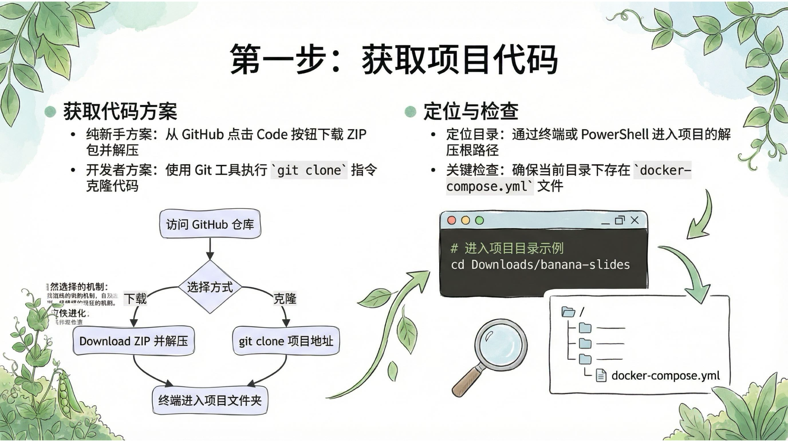

# Banana Slides 新手部署教程 - 图文演示

> 📖 本文档配合 [NEWBIE_DEPLOYMENT.md](./NEWBIE_DEPLOYMENT.md) 使用，通过图文并茂的方式展示 Banana Slides 的部署和使用过程。

---

## 📑 教程 PPT 预览

以下是根据本教程生成的完整 PPT 演示，共 12 页，展示了从部署到使用的完整流程：

### 第 1 页：封面

---

### 第 2 页：目录

---

### 第 3 页：Banana Slides 是什么？

---

### 第 4 页：它和传统 PPT 制作有什么不同？

---

### 第 5 页：它是怎么工作的？

---

### 第 6 页：为什么需要"部署"？

---

### 第 7 页：适合谁使用？

---

### 第 8 页：部署前准备

---

### 第 9 页：系统要求

---

### 第 10 页：一键部署步骤

---

### 第 11 页：常见问题排查

---

### 第 12 页：总结与展望

---

## 📖 相关文档

- 📝 [返回部署教程](./NEWBIE_DEPLOYMENT.md)
- 💬 [加入交流群](../README.md#交流群)
